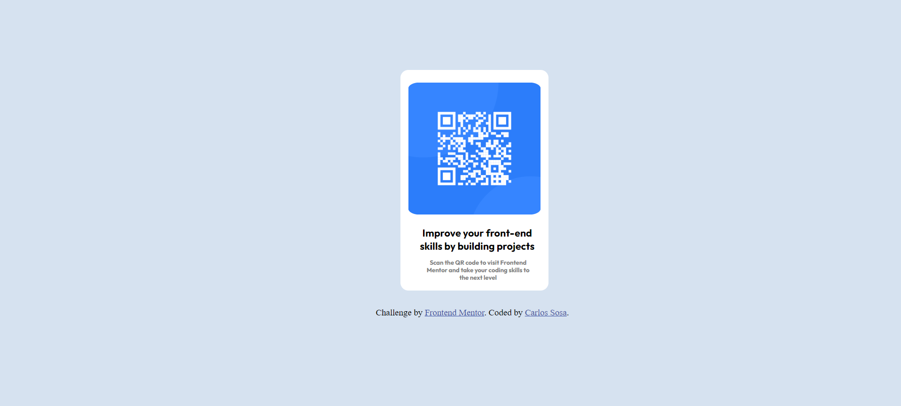

# Frontend Mentor - QR code component solution

This is a solution to the [QR code component challenge on Frontend Mentor](https://www.frontendmentor.io/challenges/qr-code-component-iux_sIO_H). Frontend Mentor challenges help you improve your coding skills by building realistic projects. 

## Table of contents

- [Overview](#overview)
  - [Screenshot](#screenshot)
  - [Links](#links)
- [My process](#my-process)
  - [Built with](#built-with)
  - [What I learned](#what-i-learned)
  - [Continued development](#continued-development)
  - [Useful resources](#useful-resources)
- [Author](#author)

## Overview

### Screenshot



### Links

- Solution URL: [Add solution URL here](https://github.com/Carlos-GitHob/QR-code-with-HTML-and-CSS.git)
- Live Site URL: [Add live site URL here](https://carlos-githob.github.io/QR-code-with-HTML-and-CSS/)

## My process

### Built with

- Semantic HTML5 markup
- CSS custom properties
- Flexbox
- CSS Grid
- Media queries

### What I learned

There were many concepts that I applied in the creation of this QR code. There was the centering of the div class card that holds the contents of the QR code itself alongside the text using position and display properties on CSS:

```html
<div class="card">
      
      <h1>Improve your front-end skills by building projects</h1>

      <p id="scan">
        Scan the QR code to visit Frontend Mentor and take your coding skills to
        the next level
      </p>
    </div>
```
```css
.card {
  background-color: hsl(0, 0%, 100%);
  border: 3px solid white;
  border-radius: 18px;
  width: 332px;
  height: 497px;

  display: flex;
  flex-direction: column;
  justify-content: space-between;

  position: relative;
  left: 350px;
  top: 152px;

  margin-inline: auto;
}

```
There was also the application of CSS properties of positioning, margin and block display as well as padding in the QR code image:

```html
<div class="card">
      
      <h1>Improve your front-end skills by building projects</h1>

      <p id="scan">
        Scan the QR code to visit Frontend Mentor and take your coding skills to
        the next level
      </p>
    </div>
```
```css
#qr {
  display: block;
  width: auto;
  height: 300px;
  position: relative;
  margin: auto;
  padding: 20px 6px;
  border-radius: 10%;
}

```

Alongside that, there was the application of CSS properties on the h1 element and the #scan element of the text bellow the QR code image to center it properly and make it resemble the design of the challenge as close as I can. 

```html
<div class="card">
      
      <h1>Improve your front-end skills by building projects</h1>

      <p id="scan">
        Scan the QR code to visit Frontend Mentor and take your coding skills to
        the next level
      </p>
    </div>
```
```css
h1 {
  margin-left: 28px;
  margin-top: 0px;
  width: 288px;
  height: 56px;
  font-size: 23px;
  font-family: "Outfit", sans-serif;
  font-weight: 400;
  font-weight: bold;
}

#scan {
  color: grey;
  width: 256px;
  height: 56px;
  font-size: 14px;
  font-family: "Outfit", sans-serif;
  font-weight: 700;
  margin-left: 46px;
  margin-top: 3px;
  justify-content: center;
}


```

Another new concept that was applied here was the use of media queries so that the webpage could adapt to the diferent sizes of phones when opened. I'm still learning about it so I feel that it could be improved:

```css

@media only screen and (max-width:400px){
  .card{
    width: 90%;
    height: 90%;
  }
}

@media only screen and (max-width:300px){
  .card{
    width: 90%;
    height: 90%;
  }
}


```

### Continued development

One of the concepts I wish to continue developing in my future assignments would be to continue learning the use of media queries. I applied the media query here in this website since I wanted to see if I could adapt the QR code inside mobile devices, however, I'm still wasn't able to fully understand the useage of it and wasn't able to apply it to all sizes of most cellphones. And even the ones I feel they are decently made, I still feel that they are not well applied and they're missing something. 

In general, I want to continue developing my way of responsive web design and refine it so that my webpage look more crisp and well designed as well as make them look more professional.

Aside from media queries, there are tecniques that I have used and wish to refine like the use of position and margin. With the use of that and display flex , I was able to place the div class card that hold the QR code and text in the center of the webpage. However, I sense that perhaps there's a better way of centering a div in the center of the page. I feel satisfied with what I came up with, but there always room for improvement.

If there's a better way of refining the centering of a div in the center of the page or tips to make a better use of media queries as well as tips and ways to futher improve my responsive web design, please let me know.


### Useful resources

- [HTML & CSS course for free! by BroCode](https://www.youtube.com/watch?v=HGTJBPNC-Gw&t=8255s&pp=ygUIYnJvIGNvZGU%3D) - This helped me refresh concepts of HTML and CSS like how to apply the div clases, the use of position and margin as well as the use of display to create a flex for the QR code.


## Author

- Website - [Add your name here](https://www.your-site.com)
- Frontend Mentor - [@yourusername](https://www.frontendmentor.io/profile/Carlos-GitHob)


